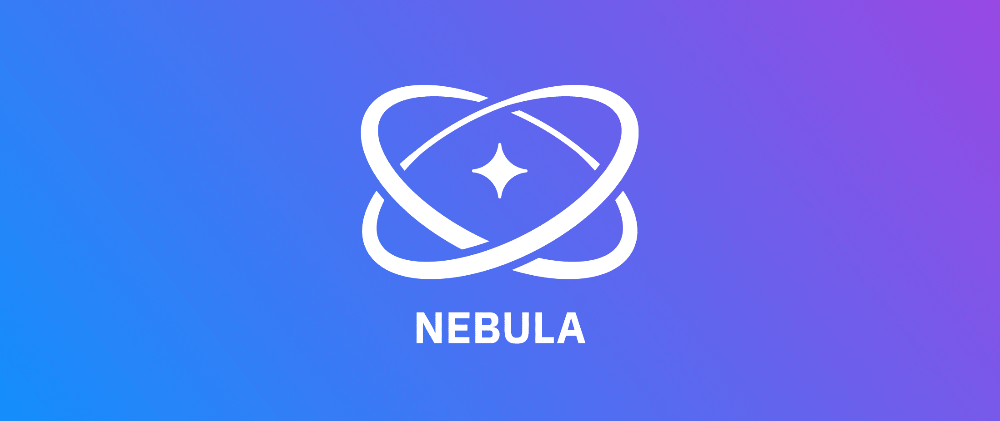

Nebula
=====

Nebula is an open-source .NET Core data abstraction library backed by Cosmos DB. It was architected to streamline the storage of domain entities in a way that promotes solid domain driven design, provides versioned append-only operations and integrates seamlessly into microservice archiectures.

Nebula leverages the speed and scailability of Cosmos DB while significantly reducing it's cost limitations by logically separating data across shared throughput allocation. This unlocks the benefits of Cosmos DB to projects with lower budgets and simplifies Cosmos DB service operational complexity where price is not a factor.

## How it works

Entities stored and retrieved with Nebula contain useful metadata. A given entity has a version identifier, deleted flag, creation time and last modified time. The version identifier can be supplied to read and write operations to fetch a particular version or to ensure that there are no concurrent modifications during an operation that requires write consistency. This provides simplified versioning for common use cases without the need to build logic on top of Cosmos DB’s change feed support directly.

Documents stored using Nebula are wrapped with framework metadata to support versioning, efficient querying etc. For example,

```json
{
  @version: 1 
  @actor: "user_id",
  @deleted: false,
  ... additional framework metadata.
  
  "store_specific_key": {
    ... immutable document content.
  }
}
```

The wrapped document content is never modified for a particular stored version. That way, a particular version of a document can be linked to an actor at a specific point of time. Query operations are available to get at all version history for a document which can be used to satisfy versioning requirements, build audit logs etc.

## Get started

### Startup configuration

### Startup.cs

```csharp
public void ConfigureServices(IServiceCollection services)
{
    services.AddNebula("FloristService", Configuration);
    
    services.AddScoped<FlowerStore>();
}
```

```csharp
public void Configure(IApplicationBuilder app)
{
    app.UseNebula();
}
```

### appsettings.json

```javascript
{
  "Nebula": {
    "ServiceEndpoint": "https://localhost:8081",
    "AuthKey": "C2y6yDjf5/R+ob0N8A7Cgv30VRDJIWEHLM+4QDU5DE2nQ9nDuVTqobD4b8mGGyPMbIZnqyMsEcaGQy67XIw/Jw=="
  }
}

```
### Example store

```csharp
public class FlowerStore : VersionedDocumentStore
{
    private readonly DocumentTypeMapping<Daisy> _mapping;

    private readonly DocumentStoreConfig _config;
    private readonly IVersionedDocumentStoreClient _client;

    public FlowerStore(IDocumentDbAccessProvider dbAccessProvider) : base(dbAccessProvider, false)
    {
        var config = new DocumentStoreConfigBuilder("Flowers");
        var documentType = config.AddDocument("Daisy").Finish();

        _mapping = config.AddDocumentMapping<Daisy>(documentType.DocumentName)
            .SetIdMapper(x => x.Id.ToString())
            .SetPartitionMapper(x => x.Id.ToString())
            .Finish();

        _config = config.Finish();
        _client = CreateStoreLogic(DbAccess, _config);

        DbAccess.ConfigRegistry.RegisterStoreConfigSource(this);
    }

    protected override DocumentStoreConfig StoreConfig
    {
        get { return _config; }
    }

    protected override IVersionedDocumentStoreClient StoreClient
    {
        get { return _client; }
    }

    public async Task<Daisy> GetById(Guid id)
    {
        var result = await StoreClient.GetDocumentAsync(id.ToString(), _mapping, null);

        return result.Document;
    }

    public async Task Upsert(Daisy daisy)
    {
        await StoreClient.UpsertDocumentAsync(daisy, _mapping, new OperationOptions());
    }
}
```
